```{r, echo=FALSE, include=FALSE}
library("ggplot2")
library("dplyr")

```


## Чем будем заниматься 

- Посмотрим на то, что уже знаем под новым углом

- Немного углубим знания 

- Будем смотреть презы, писать код, болтать, решать задачки на доске 

- Попробуем быть поближе к реальности


## В чём будем заниматься 

- Конечно же в R

- R очень лёгок в освоении

- Одна из самыз красивых визуализаций данных 

- Очень хорош в работе со статистикой 

- Много готовых пакетов и большое комьюнити

- Используется многими компаниями в работе, вот устаревший [мини-список](blog.revolutionanalytics.com/2014/05/companies-using-r-in-2014.html)


## Про активности 

- Не делаешь сам $\Rightarrow$ никогда не научишься $\Rightarrow$ три большие домашки

- Домашки делаются в командах по три человека, баллы ставятся на команду 

- Для зачёта надо набрать .....

- Две команды, набравшие наибольшее количество баллов свожу в офис Яндекса почилить на крыше под винишко 

- В каждой домашке много рыбёшек и большой кит, можно решать только то, к чему лежит душа  


## Теория вероятностей 

- Мы изучали вероятности

- Мы изучали события 

- Мы изучали случайные величины и их распределения 

- __ЗАЧЕМ МЫ ЭТО ДЕЛАЛИ?__

## Случайные ли величины? 

<center>
 
</center>


## {data-background="intro_1.png"}

## Демон Лапласа 

<center>
 
</center>

## Байесовский взгляд на вероятность 

- Лаплас: детерминизм, мы могли бы идеально прогнозировать вселенную, если бы измерили точное положение каждого атома. Издержки этого огромны. 

- Между совершенством природы и несовершенством человеческого познания огромный разрыв. 

- Неопределённость — результат этого разрыва. Случайность — это результат нашего невежества, а вероятность способ это невежество измерить. 


## Частотный взгляд на вероятность 

- Наука не может рассматривать вероятность как субъективную меру невежества.

- Можно оценивать вероятности только тех событий, которые происходят более одного раза.

- Вопрос «Какова вероятность, что кандидат N победит на выборах?» не имеет ответа, так как событие уникально и не обладает «частотой».


## Что мы имеем 

<center>
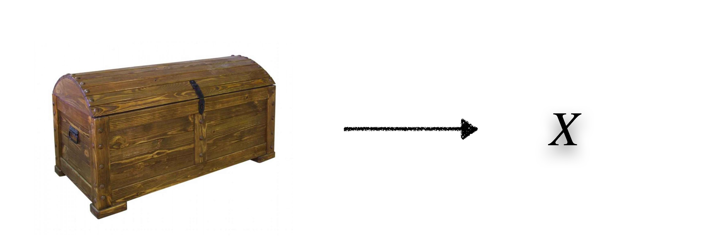 
</center>

- <font size="5.5"> Сундук — различные процесс порождения данных. Теория вероятностей изучает этот сундук. В реальности мы его не видим. </font>

- <font size="5.5"> В реальном мире мы видим выборки, которые сундук выплёвывает на нас. Математическая статистика изучает испражнения сундука и по ним пытается восстановить его внутренности. </font> 


## Хлам из сундука

<center>
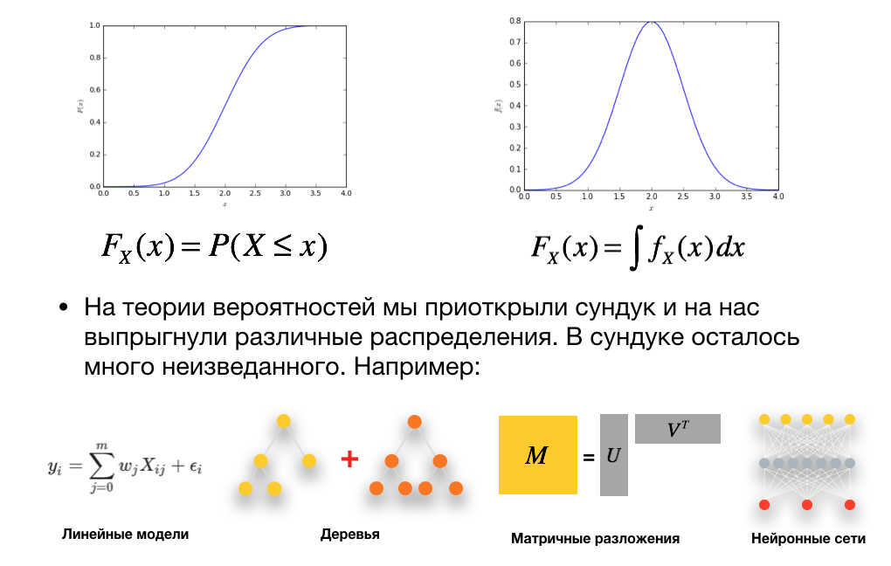 
</center>


## Чем плюётся сундук 

- Выборки, по которым можно попробовать восстановить его внутренности 

<center>
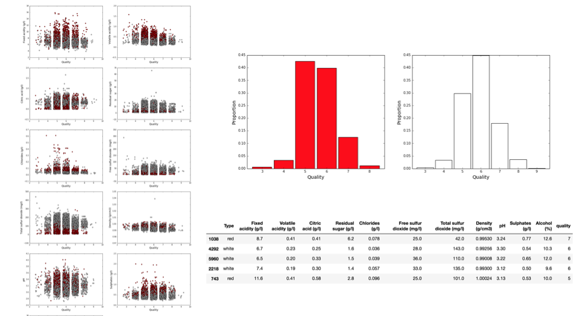 
</center>


## Базовые теоремы 

- Все манипуляции по восстановлению внутренностей сундука по его испражнениям позволяет делать ряд теорем.

- Некоторые из них вы уже знаете, __что это за теоремы?__ 

# Закон больших чисел

## Закон больших чисел 

- ЗБЧ утверждает, что среднее арифметическое большого числа похожих случайных величин «стабилизируется» с рочтом их числа

- Как бы сильно случайные величины не отклонялись от своего среднего значения, эти отклонения взаимно гасятся и среднее арифметическое приближается к постоянной величине

\[
\frac{X_1 + \ldots + X_n}{n} - \frac{E(X_1) + \ldots + E(X_n)}{n} \overset{p}{\to} 0
\]

- ЗбЧ сформулировано довольно много: Чебышёва, Бернулли, Хинчина и тд


## Закон больших чисел 

<center>
 
</center>


## Вопрос про больницы

Есть две больницы: маленькая и большая 

<center>
 
</center>

- В обеих принимают роды, выяснилось, что в одной из больниц оценка вероятности появления мальчика составила $0.7$

- В какой из больниц это произошло и почему? 


## Вопрос про больницы

Есть две больницы: маленькая и большая 

<center>
 
</center>

- Скорее всего, это произошло в маленькой больнице. При малых объёмах выборки вероятность отклониться от $0.5$ больше. Именно это нашёптывает нам ЗБЧ. 


## Слабая форма ЗБЧ (Пафнутий Чебышёв)

Пусть $X_1, \ldots, X_n$ попарно независимые и одинаково распределённые случайные величины с конечным вторым моментом, $E(X_i^2) < \infty$, тогда имеет место сходимость 

\[
\frac{X_1 + \ldots + X_n}{n} \overset{p}{\to} E(X_1)
\]


## Сильная форма ЗБЧ

Пусть $X_1, \ldots, X_n$ попарно независимые и одинаково распределённые случайные величины с конечным вторым моментом, $E(X_i^2) < \infty$, причём $\sum_{k=1}^{\infty} \frac{Var(X_k)}{k^2} < \infty$, тогда имеет место сходимость 

\[
\frac{X_1 + \ldots + X_n}{n} \overset{п.н.}{\to} E(X_1)
\]


## Страховые компании 

- Примерно с $1600$-х годов ЗБЧ позволяет зарабатывать деньги на страховании

- __Упражнение:__ для $25$-летней девушки вероятность прожить ещё год составляет $0.9$. Страховка в год стоить $1000$ рублей при взносе в $110$ рублей. Какой будет средняя прибыль компании с одной страховки? 


## Страховые компании 

$X_i$ — прибыль с одной страховки 

<center>
| $X_i$  | $110$ | $-890$  | 
|---|---|---|
| $P(\ldots)$  |  $0.9$ | $0.1$  |
</center>


Средняя прибыль компании составит $\frac{1}{n} \sum X_i$. По закону больших чисел:

$$
\frac{1}{n} \sum_{i=1}^n X_i \overset{p}{\to} E(X_1) = 0.9 \cdot 110 - 0.1 \cdot 890 = 10
$$

## Генерации разных штук

- Другой ништяк, который нам разрешает ЗБЧ — генерация случайных величин для оценки разных математических ожиданий и тп 

- Не можешь посчитать? Сгенерируй! 

- Обычно такие генерации называют методом Монте-Карло 

## Метод Монте-Карло

- __Метод Монте-Карло__ это общее название группы численных методов, основанных на получении большого числа реализаций случайного процесса, который формируется таким образом, чтобы его вероятностные характеристики совпадали с аналогичными величинами решаемой задачи 

# Генерации в R

## Генерации в R 

- Чтобы сварить в R любую случайную величину, нужно знать четыре буквы: r, d, p и q 


* __rnorm__ эта команда сгенерирует выборку из нормального распределения
* __dnorm__ эта команда вычислит значение плотности в указанной точке
* __pnorm__ эта команда находит вероятность 
* __qnorm__ эта команда находит квантили 


## Генерируем нормальную выборку

Хочу сгенерировать нормальную случайную величину 

$$
f(x) = \frac{1}{\sigma \sqrt{2 \pi}} \cdot  e^{-\frac{(x - \mu)^2}{2 \sigma^2}}
$$

<center>
```{r, results = 'hold', fig.height=3, fig.keep='all'}
x <- rnorm(5, mean=5, sd=3)  # если дисперсия 9, 
x                            # то стандартное отклонение 3
```
</center>

Хочу узнать $f(3)$

<center>
```{r, results = 'hold', fig.height=3, fig.keep='all'}
dnorm(3, mean=5, sd=3)                        
```
</center>


## Генерируем нормальную выборку

Хочу узнать $F(3) = P(X \le 3)$

<center>
```{r, results = 'hold', fig.height=3, fig.keep='all'}
pnorm(3, mean=5, sd=3)                     
```
</center>


## Генерируем нормальную выборку

Хочу узнать $F(3)$

\[
F(3) = P(X < 3) = \int_{-\infty}^3 f(x)dx
\]

<center>
```{r, results = 'hold', fig.height=3, fig.keep='all'}
pnorm(3, mean=5, sd=3)                     
```
</center>

Хочу узнать $P(4 < X < 9)$ - ? 


## Генерируем нормальную выборку

\[
F(3) = P(X < 3) = \int_{-\infty}^3 f(x)dx
\]

<center>
```{r, results = 'hold', fig.height=3, fig.keep='all'}
pnorm(3, mean=5, sd=3)                     
```
</center>

\[
P(4 < X < 9) = \int_4^9 f(x) dx = F(9) - F(4)
\]

<center>
```{r, results = 'hold', fig.height=3, fig.keep='all'}
pnorm(9, mean=5, sd=3) - pnorm(4, mean=5, sd=3)                   
```
</center>


## Генерируем нормальную выборку

Квантиль уровня $\gamma$ это такое число $q$, что:

\[
P(X < q) = \gamma
\]

<center>
```{r, results = 'hold', fig.height=3, fig.keep='all'}
qnorm(0.7, mean=5, sd=3)                   
```
</center>


<center>
```{r, results = 'hold', fig.height=3, fig.keep='all'}
x <- c(0.95, 0.975, 0.995)
qnorm(x, mean = 0, sd = 1)                
```
</center>

## Генерируем нормальную выборку

Что генерирует команда ниже? 

<center>
```{r, results = 'hold', fig.height=3, fig.keep='all'}
rnorm(10)       
```
</center>


## Генерируем нормальную выборку

Можно посчитать для случайной величины какие-нибудь характеристики

<center>
```{r, results = 'hold', fig.height=3, fig.keep='all'}
x <- rnorm(1000, mean=5, sd=3)

mean(x) # среднее

var(x) # выборочная дисперсия

sd(x) # выборочное стандартное отклонение

median(x) # выборочная медиана
```
</center>


## Генерируем нормальную выборку

Можно построить гистограму

<center>
```{r, results = 'hold', fig.height=3, fig.keep='all'}
library("ggplot2")  # пакет для красивых картинок

x <- rnorm(1000, mean=5, sd=3)

qplot(x) # гистограма 
```
</center>


## Генерируем нормальную выборку

Можно построить функцию плотности

<center>
```{r, results = 'hold', fig.height=3, fig.keep='all'}
library("ggplot2")  # пакет для красивых картинок

x <- seq(-5, 15, by=0.01)
y <- dnorm(x, mean=5, sd=3)

qplot(x, y, geom="line")
```
</center>


## Генерируем нормальную выборку

Можно построить функцию распределения

<center>
```{r, results = 'hold', fig.height=3, fig.keep='all'}
library("ggplot2")  # пакет для красивых картинок

x <- seq(-5, 15, by=0.01)
y <- pnorm(x, mean=5, sd=3)

qplot(x, y, geom="line")
```
</center>


## Зачем всё это надо?

- Чтобы решать реальные проблемы! Например, пусть $X \sim N(5,3)$. Как найти $E \left(\frac{1}{X} \right)$? 

- Спосбо первый: 

\[
E \left(\frac{1}{X} \right) = \int_{-\infty}^{+\infty} \frac{1}{x} \cdot \frac{1}{\sigma \sqrt{2 \pi}} \cdot  e^{-\frac{(x - 5)^2}{2 \cdot 3^2}} dx
\]


## Зачем всё это надо?

- Чтобы решать реальные проблемы! Например, пусть $X \sim N(5,3)$. Как найти $E \left(\frac{1}{X} \right)$? 

- Способ второй: 

<center>
```{r, results = 'hold', fig.height=3, fig.keep='all'}
n_obs <- 10^6 # число наблюдений 

x <- rnorm(n_obs, mean = 5, sd = 3)

mean(1/x)
```
</center>


## Зачем всё это надо?

- Чтобы решать реальные проблемы! Например, пусть $X \sim N(5,3)$. Как найти $E \left(\frac{1}{X} \right)$? 

- Способ второй: 

<center>
```{r, results = 'hold', fig.height=3, fig.keep='all'}
n_obs <- 10^6 # число наблюдений 

x <- rnorm(n_obs, mean = 5, sd = 3)

mean(1/x)
```
</center>

- ЗБЧ разрешает нам так делать! 


## Зачем всё это надо?

- $X_1, X_2, X_3 \sim U[0;2]$, независимые

- Хотим знать $P(X_1 + X_2 + X_3^2 > 5)$


## Зачем всё это надо?

- $X_1, X_2, X_3 \sim U[0;2]$, независимые

- Хотим знать $P(X_1 + X_2 + X_3^2 > 5)$

<center>
```{r, results = 'hold', fig.height=3, fig.keep='all'}
n_obs <- 10^6
x_1 <- runif(n_obs, min = 0, max = 2)
x_2 <- runif(n_obs, min = 0, max = 2)
x_3 <- runif(n_obs, min = 0, max = 2)

success <- x_1 + x_2 + x_3^2 > 5

success[1:5]

sum(success) / n_obs
```
</center>


## Зачем всё это надо?

- $X_1, X_2, X_3 \sim U[0;2]$, независимые

- Хотим знать $$P(X_1 + X_2 > 0.8 \mid X_3 < 0.1)$$


## Зачем всё это надо?

- $X_1, X_2, X_3 \sim U[0;2]$, независимые

- Хотим знать $$P(X_1 + X_2 > 0.8 \mid X_3 < 0.1)$$

<center>
```{r, results = 'hold', fig.height=3, fig.keep='all'}
n_obs <- 10^6
x_1 <- runif(n_obs, min = 0, max = 2)
x_2 <- runif(n_obs, min = 0, max = 2)
x_3 <- runif(n_obs, min = 0, max = 2)

uslovie <- x_3 < 0.1
x_1[1:5]
x_3[1:5]
uslovie[1:5]
x_1[uslovie][1:5]
```
</center>


## Зачем всё это надо?

- $X_1, X_2, X_3 \sim U[0;2]$, независимые

- Хотим знать $$P(X_1 + X_2 > 0.8 \mid X_3 < 0.1)$$

<center>
```{r, results = 'hold', fig.height=3, fig.keep='all'}
n_obs <- 10^6
x_1 <- runif(n_obs, min = 0, max = 2)
x_2 <- runif(n_obs, min = 0, max = 2)
x_3 <- runif(n_obs, min = 0, max = 2)

uslovie <- x_3 < 0.1

success <- x_1[uslovie] + x_2[uslovie] > 0.8

sum(success)/n_obs
```
</center>


## Генерация выборок 

С такой же лёгкостью можно генерировать любые выборки

<center>
```{r, results = 'hold', fig.height=3, fig.keep='all'}
sample(1:10, size = 8)  # выборка без повторений

sample(1:10, size = 8, replace = TRUE) # с повторениями
```
</center>

<center>
```{r, results = 'hold', fig.height=3, fig.keep='all'}
# неправильная монетка 
sample(c("Орёл", "Решка"), size = 5, replace = TRUE, prob = c(0.3, 0.7))
```
</center>


## ЗБЧ и монетка 

<center>
```{r, results = 'hold', fig.height=3, fig.keep='all'}
x <-  sample(c("Орёл", "Решка"), size = 10^6, replace = TRUE, prob = c(0.3, 0.7))

sum(x == 'Орёл')/length(x)
```
</center>

# Центральная предельная теорема (ЦПТ)

## ЦПТ 

- При определённых условиях сумма достаточно большого числа случайных величин имеет распределение близкое к нормальному 

- __Главное:__ чтобы случайные величины были похожи и не было такого, что одна резко выделяется на фоне остальных 

- Есть много разных ЦПТ с разными условиями 


## Классическая формулировка ЦПТ 

Пусть $X_1, \ldots, X_n, \ldots$ — последовательность независимых одинаковых случайных велчин с конечным вторым моментом $E(X_i^2) < \infty$. Тогда 

<br>

\[
\frac{(X_1 + \ldots + X_n) - n \cdot E(X_1)}{\sqrt{n \cdot Var(X_1)}} \overset{d}{\to} N(0,1)
\]


## ЦПТ и равномерное распределение 

- Пусть $X \sim U[-1;1]$, пусть $Y = X_1 + \ldots + X_n$ 

<center>
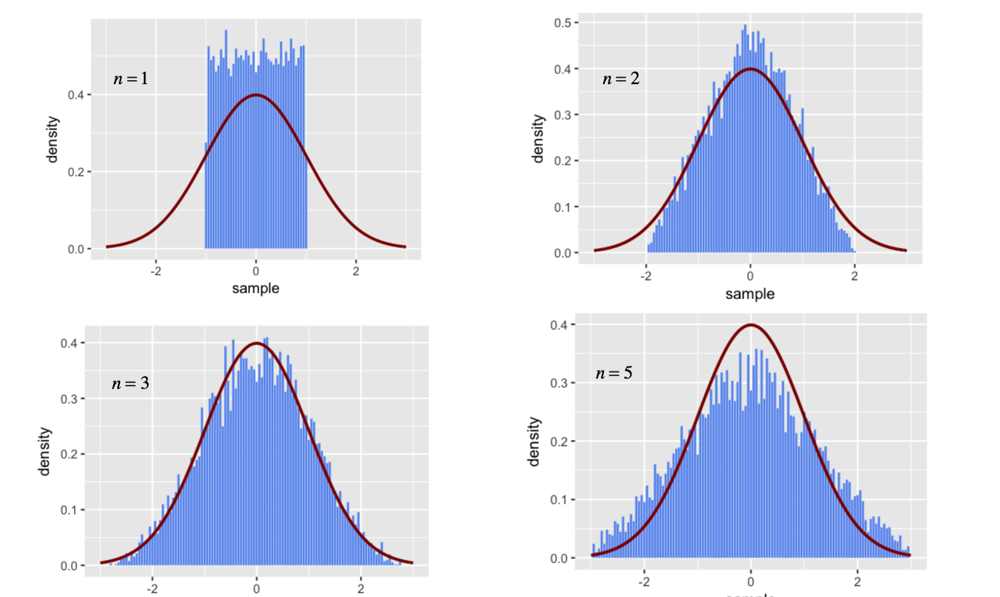 
</center>


## Доска Гальтона 

<center>
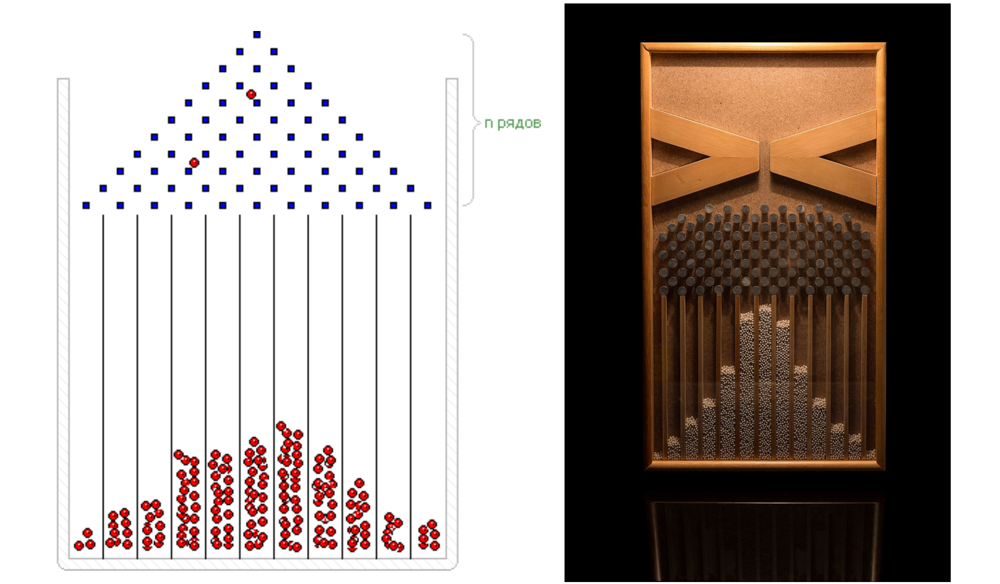 
</center>


## ЦПТ на пальцах 

- $Y$ — время прихода на первую пару 


## ЦПТ на пальцах 

- $Y$ — время прихода Саши на первую пару 

- На Сашу прыгнул кот и он проснулся пораньше, ускорение на $X_1$ 

- Пока готовил завтрак, убежало молоко, задержка на $X_2$ 

- Быстро приехал автобус, ускорение на $X_3$ 

- Встал в неожиданную пробку, задержка на $X_4$ 

<center>
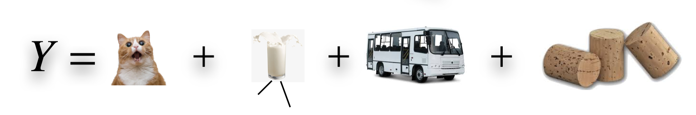 
</center>


## ЦПТ на пальцах 

<center>
 
</center>

- Ни одна из величин не выделяется! 

<center>
```{r, echo=FALSE, results = 'hold', fig.height=3, fig.keep='all'}
library("ggplot2")  # пакет для красивых картинок

x <- seq(-5, 15, by=0.01)
y <- dnorm(x, mean=5, sd=3)

qplot(x, y, geom="line")
```
</center>


## ЦПТ и ЗБЧ как скорости

В ЗБЧ: 

\[
\frac{X_1 + \ldots + X_n - n E(X_1)}{n} \overset{p}{\to} 0
\]

<br>

В ЦПТ та же дробь домножается на $\sqrt{n}$, это замедляет сходимость и мы приходим к более интересному результату: 

\[
\sqrt{n} \cdot \frac{X_1 + \ldots + X_n - n E(X_1)}{n} \overset{d}{\to} N(0, Var(X_1))
\]


## Крайнестан и среднестан 

- ЦПТ и ЗБЧ работают в среднестане 

- А что, если какая-то одна случайная величина выбивается? 

- Тогда мы перемещаемся из среднестана в крайнестан и сталкиваемся с проблемой тяжёлых хвостов 

- О тяжёлых хвостах мы ещё поговорим, они часто выскакивают в мире финансов 


# Фальсификации 

## Примеры случайностей из среднестана

- Хочу примеры случайных величин, которые складываются из суммы других и из-за этого имеют нормальное распределение! 


## Примеры случайностей из среднестана

- Хочу примеры случайных величин, которые складываются из суммы других и из-за этого имеют нормальное распределение! 

- Рост человека, вес человека 

- Погрешность весов 

- Выборочное среднее, посчитанное по выборке объёма $100$ 

- Умственные способности человека, его балл человека за ЕГЭ


## Результаты ЕГЭ в Польше 

<center>
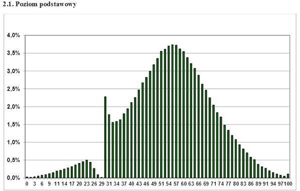 
</center>


## Результаты ЕГЭ в Польше 

- Подозрительный пик в районе проходного балла 

- Подозрительный пик на $100$ баллах 

<center>
 
</center>


## Явка на выборы 

- Явка на выборы вроде бы находится в среднестане, выборы довольно масштабное явление 


## Выборы в европейских странах 

[Последние выборы в Германии и Франции](https://meduza.io/feature/2018/03/13/tsentrizbirkom-prizyvaet-ne-otsenivat-vybory-po-gaussu-eto-i-pravda-ne-luchshiy-metod)

<center>
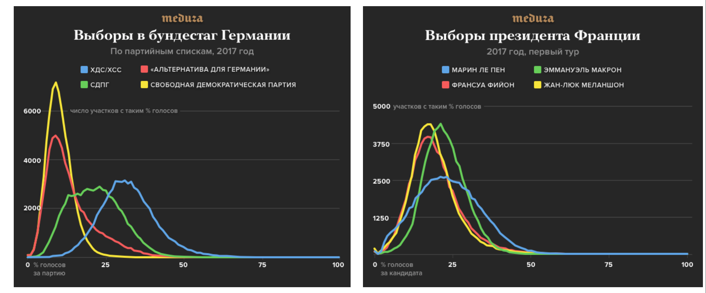 
</center>

## Выбры в ещё парочке стран 

<center>
 
</center>


## Выборы в России 

<center>
 
</center>

- Странное распределение явки, пики в круглых числах: $55$, $60$, $65$, $70$


## Выборы в Москве 

В Москве с распределением явки всё окей 

<center>
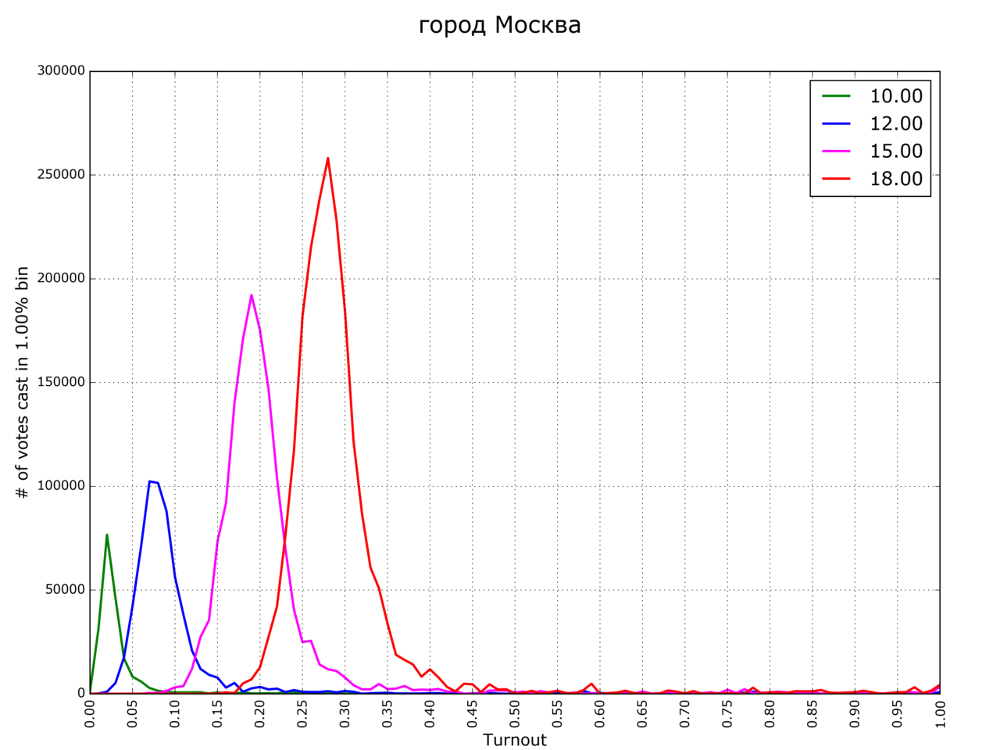 
</center>


## Выборы в Кемерово 

В Кемерово наблюдается пила Чурова 

<center>
 
</center>


## ?????????? 

- Голосование в России противоречит ЦПТ и результатам электоральных исследований по другим странам 

- На волеизъявление людей что-то повлияло 


## Ответ ЦИК 

- ЦИК при Чурове в ответ на критику написал [свою научную работу](http://cikrf.ru/activity/relevant/detail/29380/)

- Множество избирателей неоднородно, в сёлах массово сильны провластные взгляды, нужно детализировать подмножества избирателей 
<center>
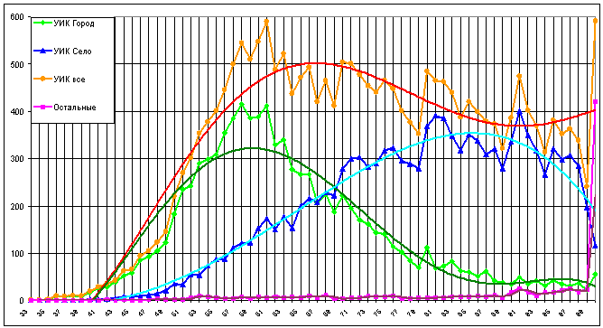 
</center>

## Зависимость от явки 

- Главный вопрос в зависимости результатов одной партии от явки 

<center>
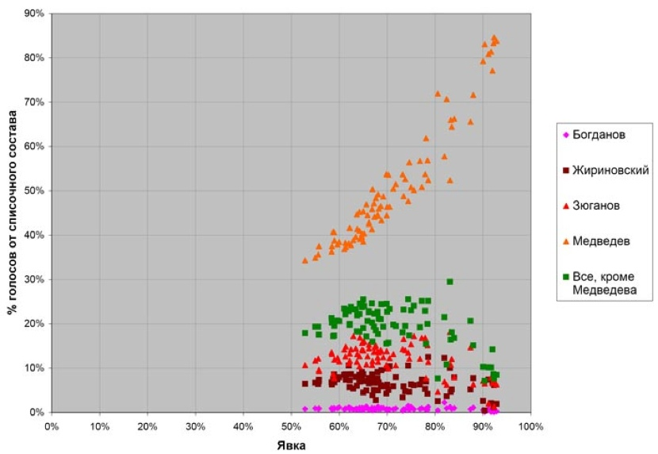 
</center>


## Корректировка результатов голосования

<center>
 
</center>


## Выводы 

- Не факт, что явка на выборы должна быть куполообразной в неоднородных странах 

- Чисто теоретически доля кандидата может зависеть от явки, но это неточно 

- Тем не менее, декомпозиция по кандидатам и участкам с автоподсчётом голосов могут являться косвенным доказательством наличия вбросов 


## Полезные ссылки 

- [Сайт центризберкома](http://www.vybory.izbirkom.ru/region/izbirkom)

- [Код на питоне для сбора данных с сайта ЦИК](http://nbviewer.jupyter.org/github/FUlyankin/Parsers/blob/master/Parsers\%20/Результаты\%20Выборов/Фальсификации\%2C\%20выборы.ipynb)

- [Статья на хабре,](https://habrahabr.ru/company/ods/blog/346632/) которая учит парсингу на питоне 

- [Уже готовые датасеты](http://els.golosinfo.org/ru/elections?utf8=✓\&q\%5Beday_day_eq\%5D=\&q\%5Beday_month_eq\%5D=\&q\%5Beday_year_eq\%5D=\&q\%5Bregion_id_eq\%5D=\&q\%5Belevel_id_in_any\%5D\%5B\%5D=1\&q\%5Bname_ru_cont\%5D=) движения за честные выборы «Голос».


# Случайности бывают разными 

## Распределение Бернулли 


## Биномиальное распределение 


## Распределение Пуассона 


## Любое дискретное распределение 


## Вырожденное распределение


## Экспоненциальное распределение 


## Равномерное распределение 


## Связь распределений 


## Безумные рекомендации 


