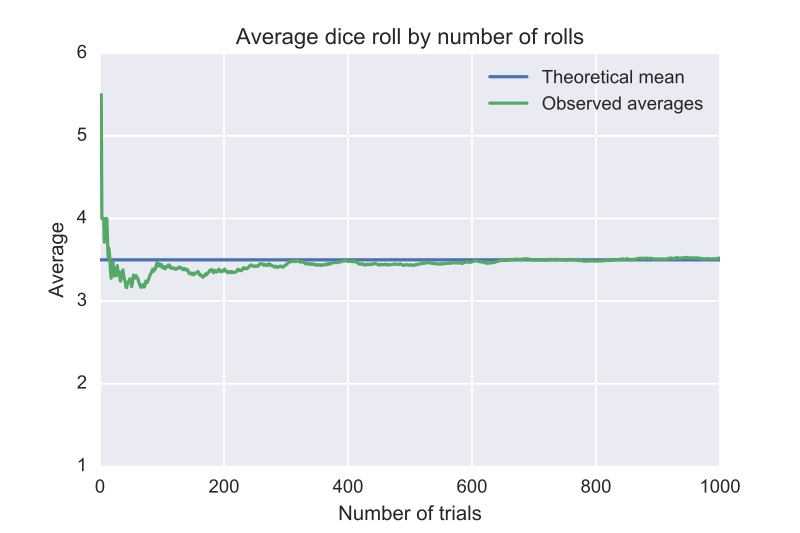

```{r, echo=FALSE, include=FALSE}
library("ggplot2")
library("dplyr")

```


# Камила, Вика и монетки 

## Камила, Вика и монетки 

Две монеты, вероятности орла равны $0.6$ и $0.4$. Камила подбрасывает первую монетку до появления орла. Вика вторую. Найдите с помощью симуляций вероятность того, что Вика сделает больше подбрасываний, чем Камила


## Камила, Вика и монетки 

Две монеты, вероятности орла равны $0.6$ и $0.4$. Камила подбрасывает первую монетку до появления орла. Вика вторую. 

__а)__ Найдите с помощью симуляций вероятность того, что Вика сделает больше подбрасываний, чем Камила

<center>
```{r, results = 'hold', fig.height=3, fig.keep='all'}
n_obs = 10^6
p1 = 0.6
p2 = 0.4 
```
</center>


## Камила, Вика и монетки 

Две монеты, вероятности орла равны $0.6$ и $0.4$. Камила подбрасывает первую монетку до появления орла. Вика вторую. 

__а)__ Найдите с помощью симуляций вероятность того, что Вика сделает больше подбрасываний, чем Камила

<center>
```{r, results = 'hold', fig.height=3, fig.keep='all'}
n_obs = 10^6
p1 = 0.6
p2 = 0.4 

# симулируем подбрасывания Вики и Камилы
x_kamila = rgeom(n_obs, prob = p1)
x_vika = rgeom(n_obs, prob = p2)

x_kamila[1:10]  # в векторе стоит число подбрасываний до первого орла
```
</center>


## Камила, Вика и монетки 

Две монеты, вероятности орла равны $0.6$ и $0.4$. Камила подбрасывает первую монетку до появления орла. Вика вторую. 

__а)__ Найдите с помощью симуляций вероятность того, что Вика сделает больше подбрасываний, чем Камила

<center>
```{r, results = 'hold', fig.height=3, fig.keep='all'}
n_obs = 10^6
p1 = 0.6
p2 = 0.4 

# симулируем подбрасывания Вики и Камилы
x_kamila = rgeom(n_obs, prob = p1)
x_vika = rgeom(n_obs, prob = p2)

sum(x_vika > x_kamila)/n_obs
```
</center>


## Камила, Вика и монетки 

Две монеты, вероятности орла равны $0.6$ и $0.4$. Камила подбрасывает первую монетку до появления орла. Вика вторую. 

__б)__ Камила сделает больше подбрасываний, чем Вика;


## Камила, Вика и монетки 

Две монеты, вероятности орла равны $0.6$ и $0.4$. Камила подбрасывает первую монетку до появления орла. Вика вторую. 

__б)__ Камила сделает больше подбрасываний, чем Вика;

<center>
```{r, results = 'hold', fig.height=3, fig.keep='all'}
n_obs = 10^6
p1 = 0.6
p2 = 0.4 

# симулируем подбрасывания Вики и Камилы
x_kamila = rgeom(n_obs, prob = p1)
x_vika = rgeom(n_obs, prob = p2)

sum(x_vika < x_kamila)/n_obs
```
</center>


## Камила, Вика и монетки 

Две монеты, вероятности орла равны $0.6$ и $0.4$. Камила подбрасывает первую монетку до появления орла. Вика вторую. 

__в)__ Камила и Вика сделают одинаковое число подбрасываний


## Камила, Вика и монетки 

Две монеты, вероятности орла равны $0.6$ и $0.4$. Камила подбрасывает первую монетку до появления орла. Вика вторую. 

__в)__ Камила и Вика сделают одинаковое число подбрасываний

<center>
```{r, results = 'hold', fig.height=3, fig.keep='all'}
n_obs = 10^6
p1 = 0.6
p2 = 0.4 

# симулируем подбрасывания Вики и Камилы
x_kamila = rgeom(n_obs, prob = p1)
x_vika = rgeom(n_obs, prob = p2)

sum(x_vika == x_kamila)/n_obs
```
</center>


## Камила, Вика и монетки 

Две монеты, вероятности орла равны $0.6$ и $0.4$. Камила подбрасывает первую монетку до появления орла. Вика вторую. 

__г)__ Верно ли, что в сумме эти три вероятности дают единицу? Логично ли это?

<center>
```{r, results = 'hold', fig.height=3, fig.keep='all'}
n_obs = 10^6
p1 = 0.6
p2 = 0.4 

# симулируем подбрасывания Вики и Камилы
x_kamila = rgeom(n_obs, prob = p1)
x_vika = rgeom(n_obs, prob = p2)

sum(x_vika > x_kamila)/n_obs + sum(x_vika < x_kamila)/n_obs + sum(x_vika == x_kamila)/n_obs
```
</center>


# Человек и параход

## Человек и параход

Иван Фёдорович Крузенштерн (ШТО?!) случайным образом с возможностью повторов выбирает $10$ натуральных чисел от $1$ до $100$. Пусть $X$ — минимум из этих чисел, а $Y$ — максимум. С помощью симуляций оцените

__а)__ $P(Y > 3X)$

## Человек и параход

Иван Фёдорович Крузенштерн (ШТО?!) случайным образом с возможностью повторов выбирает $10$ натуральных чисел от $1$ до $100$. Пусть $X$ — минимум из этих чисел, а $Y$ — максимум. С помощью симуляций оцените

__а)__ $P(Y > 3X)$

<center>
```{r, results = 'hold', fig.height=3, fig.keep='all'}
natural <- sample(1:100, size = 5, replace = TRUE)

natural

min(natural)  # случайная величина X
max(natural)  # случайная величина Y
```
</center>


## Человек и параход

Иван Фёдорович Крузенштерн (ШТО?!) случайным образом с возможностью повторов выбирает $10$ натуральных чисел от $1$ до $100$. Пусть $X$ — минимум из этих чисел, а $Y$ — максимум. С помощью симуляций оцените

__а)__ $P(Y > 3X)$

<center>
```{r, results = 'hold', fig.height=3, fig.keep='all'}
n_obs = 10^6
x = rep(0, n_obs)  
y = rep(0, n_obs)

```
</center>


## Человек и параход

Иван Фёдорович Крузенштерн (ШТО?!) случайным образом с возможностью повторов выбирает $10$ натуральных чисел от $1$ до $100$. Пусть $X$ — минимум из этих чисел, а $Y$ — максимум. С помощью симуляций оцените

__а)__ $P(Y > 3X)$

<center>
```{r, results = 'hold', fig.height=3, fig.keep='all'}
n_obs = 10^6
x = rep(0, n_obs)   
y = rep(0, n_obs)   

for(i in 1:n_obs){
    natural = sample(1:100, size = 10, replace = TRUE)  # сгенерировали выборку
    x[i] = min(natural)                                 # нашли минимум и максимум для неё
    y[i] = max(natural)
}
x[1:5]
```
</center>


## Человек и параход

Иван Фёдорович Крузенштерн (ШТО?!) случайным образом с возможностью повторов выбирает $10$ натуральных чисел от $1$ до $100$. Пусть $X$ — минимум из этих чисел, а $Y$ — максимум. С помощью симуляций оцените

__а)__ $P(Y > 3X)$

<center>

```{r, results = 'hold', fig.height=3, fig.keep='all'}
success = y > 3*x

x[1:5]
y[1:5]
success[1:5]
```
</center>


## Человек и параход

Иван Фёдорович Крузенштерн (ШТО?!) случайным образом с возможностью повторов выбирает $10$ натуральных чисел от $1$ до $100$. Пусть $X$ — минимум из этих чисел, а $Y$ — максимум. С помощью симуляций оцените

__а)__ $P(Y > 3X)$

<center>
```{r, results = 'hold', fig.height=3, fig.keep='all'}
success = y > 3*x

sum(success) / n_obs 
```
</center>


## Человек и параход

Иван Фёдорович Крузенштерн (ШТО?!) случайным образом с возможностью повторов выбирает $10$ натуральных чисел от $1$ до $100$. Пусть $X$ — минимум из этих чисел, а $Y$ — максимум. С помощью симуляций оцените

__б)__ $E(X \cdot Y)$


## Человек и параход

Иван Фёдорович Крузенштерн (ШТО?!) случайным образом с возможностью повторов выбирает $10$ натуральных чисел от $1$ до $100$. Пусть $X$ — минимум из этих чисел, а $Y$ — максимум. С помощью симуляций оцените

__б)__ $E(X \cdot Y)$

<center>
```{r, results = 'hold', fig.height=3, fig.keep='all'}
mean(x*y)
```
</center>


## Человек и параход

Иван Фёдорович Крузенштерн (ШТО?!) случайным образом с возможностью повторов выбирает $10$ натуральных чисел от $1$ до $100$. Пусть $X$ — минимум из этих чисел, а $Y$ — максимум. С помощью симуляций оцените

__в)__ $P(Y > 3X \mid Y < X^2)$

__г)__ $E(X \cdot Y \mid Y < X^2)$


## Человек и параход

Иван Фёдорович Крузенштерн (ШТО?!) случайным образом с возможностью повторов выбирает $10$ натуральных чисел от $1$ до $100$. Пусть $X$ — минимум из этих чисел, а $Y$ — максимум. С помощью симуляций оцените

__в)__ $P(Y > 3X \mid Y < X^2)$

__г)__ $E(X \cdot Y \mid Y < X^2)$

<center>
```{r, results = 'hold', fig.height=3, fig.keep='all'}
z <- c(1,2,3,4,5,6,7)
z > 4

z[z > 4]

```
</center>


## Человек и параход

Иван Фёдорович Крузенштерн (ШТО?!) случайным образом с возможностью повторов выбирает $10$ натуральных чисел от $1$ до $100$. Пусть $X$ — минимум из этих чисел, а $Y$ — максимум. С помощью симуляций оцените

__в)__ $P(Y > 3X \mid Y < X^2)$

__г)__ $E(X \cdot Y \mid Y < X^2)$

<center>
```{r, results = 'hold', fig.height=3, fig.keep='all'}
usl = y < x^2

success <- y[usl] > 3*x[usl]
sum(success) / n_obs  

mean(x[usl]*y[usl])
```
</center>


## Человек и параход

Иван Фёдорович Крузенштерн (ШТО?!) случайным образом с возможностью повторов выбирает $10$ натуральных чисел от $1$ до $100$. Пусть $X$ — минимум из этих чисел, а $Y$ — максимум. С помощью симуляций оцените

__д)__ $E \left( \frac{X}{X + 2Y} \right)$

__е)__ $Corr(X,Y)$


## Человек и параход

Иван Фёдорович Крузенштерн (ШТО?!) случайным образом с возможностью повторов выбирает $10$ натуральных чисел от $1$ до $100$. Пусть $X$ — минимум из этих чисел, а $Y$ — максимум. С помощью симуляций оцените

__д)__ $E \left( \frac{X}{X + 2Y} \right)$

__е)__ $Corr(X,Y)$

<center>
```{r, results = 'hold', fig.height=3, fig.keep='all'}
z = x/(x + 2*y)
mean(z)

cor(x,y)
```
</center>


# Call me maybe 

## Call me maybe 

Известно, что в пятизначном номере телефона все цифры разные. Какова вероятность того, что при этом условии среди них только одна цифра чётная (номер может начинаться с нуля)?


## Call me maybe 

Известно, что в пятизначном номере телефона все цифры разные. Какова вероятность того, что при этом условии среди них только одна цифра чётная (номер может начинаться с нуля)?

<center>
```{r, results = 'hold', fig.height=3, fig.keep='all'}
# генерируем номер телефона
sample(size = 5, 0:9, replace = FALSE)
```
</center>


## Call me maybe 

Известно, что в пятизначном номере телефона все цифры разные. Какова вероятность того, что при этом условии среди них только одна цифра чётная (номер может начинаться с нуля)?

<center>
```{r, results = 'hold', fig.height=3, fig.keep='all'}
# генерируем номер телефона
sample(size = 5, 0:9, replace = FALSE)

# проверяем все цифры на чётность 
sample(size = 5, 0:9, replace = FALSE) %% 2
```
</center>


## Call me maybe 

Известно, что в пятизначном номере телефона все цифры разные. Какова вероятность того, что при этом условии среди них только одна цифра чётная (номер может начинаться с нуля)?

<center>
```{r, results = 'hold', fig.height=3, fig.keep='all'}
# генерируем номер телефона
sample(size = 5, 0:9, replace = FALSE)

# проверяем все цифры на чётность 
sample(size = 5, 0:9, replace = FALSE) %% 2

# смотрим сколько в сумме нечётных цифр
sum(sample(size = 5, 0:9, replace = FALSE) %% 2)
```
</center>


## Call me maybe 

Известно, что в пятизначном номере телефона все цифры разные. Какова вероятность того, что при этом условии среди них только одна цифра чётная (номер может начинаться с нуля)?

<center>
```{r, results = 'hold', fig.height=3, fig.keep='all'}
# и всё это в цикле!
n_obs = 10^6

m = 0
for( i in 1:n_obs){
    # если 4 нечётные, значит одна чётная
    if(sum(sample(size = 5, 0:9, replace = FALSE) %% 2) == 4){
        m = m + 1
    }
}

m/n_obs
```
</center>


# О спорт, ты — мир

## О спорт, ты — мир

Для  $20$  участников соревнований, среди которых  $8$  российских, в гостинице забронировано  $20$  номеров. Из них  $12$  с видом на море. Участники соревнований наугад получают ключи от номернов. Найдите вероятность того, что номера с видом на море достанутся всем российским спортсменам.


## О спорт, ты — мир

$20$  участников, $8$  российских, в гостинице$20$  номеров, $12$  с видом на море. Ключи наугад. Найдите вероятность того, что номера с видом на море достанутся всем российским спортсменам.

<center>
```{r, results = 'hold', fig.height=3, fig.keep='all'}
n_obs = 10^6

# вектор номеров
room = c(rep('море',12),rep('пустошь',8))

# перемешаем номера 
sample(room)

# первые 8 - россия
sample(room)[1:8] == 'море'
```
</center>


## О спорт, ты — мир

$20$  участников, $8$  российских, в гостинице$20$  номеров, $12$  с видом на море. Ключи наугад. Найдите вероятность того, что номера с видом на море достанутся всем российским спортсменам.

<center>
```{r, results = 'hold', fig.height=3, fig.keep='all'}
# Будем считать что первые 8 позиций вектора относятся к россиянам

n_obs = 10^6

# комнаты
room = c(rep('море',12),rep('пустошь',8))

m = 0
for(i in 1:n_obs){
    if(sum(sample(room)[1:8] == 'море') == 8){
        m = m + 1
    }
}

m/n_obs
```
</center>


# А помнишь ЗБЧ? 

## А помнишь ЗБЧ? 

В начале пары мы смотрели такую картинку, давайте нарисуем её сами!

<center>
 
</center>

## А помнишь ЗБЧ? 

Игральная кость. Нам хочется узнать какое среднее значение на ней будет выпадать при увеличении количества бросков.

<center>
```{r, results = 'hold', fig.height=3, fig.keep='all'}

sample(1:6, size = 1, replace = TRUE)

sample(1:6, size = 2, replace = TRUE)

sample(1:6, size = 3, replace = TRUE)

sample(1:6, size = 4, replace = TRUE)
```
</center>


## А помнишь белые обои

Игральная кость. Нам хочется узнать какое среднее значение на ней будет выпадать при увеличении количества бросков.

<center>
```{r, results = 'hold', fig.height=3, fig.keep='all'}
n_obs = 1000
kubik = rep(0, n_obs)

```
</center>


## А помнишь чёрную посуду

Игральная кость. Нам хочется узнать какое среднее значение на ней будет выпадать при увеличении количества бросков.

<center>
```{r, results = 'hold', fig.height=3, fig.keep='all'}
n_obs = 1000
kubik = rep(0, n_obs)

for(n in 1:n_obs){ # n - количество подбрасываний кубика
    
    # Сделали выборку 
    smpl = sample(1:6, size = n, replace = TRUE)
    
    # Подсчитали среднее значение и запомнили его 
    kubik[n] = mean(smpl)   
}

kubik[1:5]
```
</center>


## Нас в хрущёвке двое

Игральная кость. Нам хочется узнать какое среднее значение на ней будет выпадать при увеличении количества бросков.

<center>
```{r, results = 'hold', fig.height=3, fig.keep='all'}
qplot(1:n_obs, kubik, geom='line', xlab='number of observations', ylab='result')
```
</center>


## Кто мы и откуда откуда


# Миша и газетный бизнес

## Миша и газетный бизнес

__Смешная предыстория, которая не влезла на слайд.__

Покупать газету Миша решил по $15$ рублей, а продавать за $30$. Количество потенциальных покупателей - случайная величина с распределением Пуассона. Опытным путём было установлено, что среднее значение этой величины равно $50$. Нераспроданные газеты ничего не стоят. Пусть $n$- количество газет, максимизирующее ожидаемую прибыль Мишы. 

С помощью компьютера найдите оптимальное значение $n$ и ожидаемую прибыль.


## Миша и газетный бизнес

Цена газеты $15$ рублей, продаёт за $30$. Количество потенциальных покупателей - распределением Пуассона, среднее значение равно $50$. Нераспроданные газеты ничего не стоят, $n$- количество газет, максимизирующее ожидаемую прибыль Мишы. 

С помощью компьютера найдите оптимальное значение $n$ и ожидаемую прибыль.

\[ \Pi = 30 \cdot X - 15 \cdot n \to \max_{n} \]


## Миша и газетный бизнес

С помощью компьютера найдите оптимальное значение $n$ и ожидаемую прибыль.

\[ \Pi = 30 \cdot X - 15 \cdot n \to \max_{n} \]

<center>
```{r, results = 'hold', fig.height=3, fig.keep='all'}
n_obs = 10^6  # число наблюдений 

cost = 15   # издержки на покупку газеты 
price = 30  # цена, по которой будем продавать газету 

x = rpois(n_obs, lambda = 50)  # среднее значение совпадает с lambda

profit = x*price - 20*cost 

# найдём среднюю прибыль 
mean(profit)
```
</center>


## Миша и газетный бизнес

С помощью компьютера найдите оптимальное значение $n$ и ожидаемую прибыль.

\[ \Pi = 30 \cdot X - 15 \cdot n \to \max_{n} \]

<center>
```{r, results = 'hold', fig.height=3, fig.keep='all'}
n_obs = 10^6  # число наблюдений 

cost = 15   # издержки на покупку газеты 
price = 30  # цена, по которой будем продавать газету 

x = rpois(n_obs, lambda = 50)  # среднее значение совпадает с lambda

x[x > 20] = 20  # заменим всё, что больше 20 на 20

profit = x*price - 20*cost 

# найдём среднюю прибыль 
mean(profit)
```
</center>


## Миша и газетный бизнес

С помощью компьютера найдите оптимальное значение $n$ и ожидаемую прибыль.

\[ \Pi = 30 \cdot X - 15 \cdot n \to \max_{n} \]

<center>
```{r, results = 'hold', fig.height=3, fig.keep='all'}
n_obs = 10^6  # число наблюдений 

profits = rep(0,100) # будем записывать средние прибыли
for(s in 1:100){
    x = rpois(n_obs, lambda = 50)  # генерируем покупочки 
    
    x[x > s] = s  # нельзя продать лишнее
    
    profits[s] = mean(x*price - s*cost)  # запоминем среднюю прибыль
}
```
</center>


## Миша и газетный бизнес

С помощью компьютера найдите оптимальное значение $n$ и ожидаемую прибыль.

<center>
```{r, results = 'hold', fig.height=3, fig.keep='all'}
# Посмотрим на график средней прибыли. Вполне ожидаемо, что это парабола
qplot(1:100, profits, geom='line')
```
</center>


## Миша и газетный бизнес

С помощью компьютера найдите оптимальное значение $n$ и ожидаемую прибыль.

<center>
```{r, results = 'hold', fig.height=3, fig.keep='all'}
# Наконец мы видим прибыль Миши и сколько газет ему надо закупать :) 
max(profits)
which.max(profits)
```
</center>


