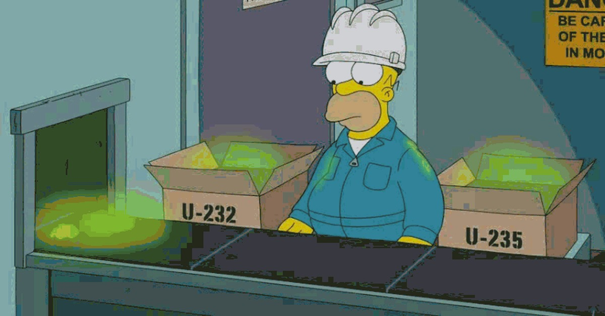

```{r, echo=FALSE, include=FALSE}
library("ggplot2")
library("dplyr")

```


# Откуда компьютер берёт случайности

## Изобретаем велосипед 

- Предположим, что мы с вами только что изобрели компьютер и нам надо научить его генерировать случайные числа. Как бы вы это сделали? 


## Изобретаем велосипед 

- Предположим, что мы с вами только что изобрели компьютер и нам надо научить его генерировать случайные числа. Как бы вы это сделали? 

- __Идея!__ Согласно квантовой теории, невозможно узнать наверняка когда произойдёт радиоактивный распад. Давайте положим в компьютер немножечко урана.

<center>
 
</center>


## Изобретаем велосипед 

- Предположим, что мы с вами только что изобрели компьютер и нам надо научить его генерировать случайные числа. Как бы вы это сделали? 

- __Идея!__ Действия человека непредсказуемы. Будем собирать те промежутки времени, которые проходят между нажатиями кнопок на клавиатуре. Это поможет генерировать случайные числа.


## Изобретаем велосипед 

- Предположим, что мы с вами только что изобрели компьютер и нам надо научить его генерировать случайные числа. Как бы вы это сделали? 

- __Идея!__ Давайте использовать непредсказуемые шумы в атмосфере. [Пример такого генератора.](https://www.random.org/)


## Изобретаем велосипед 

- Предположим, что мы с вами только что изобрели компьютер и нам надо научить его генерировать случайные числа. Как бы вы это сделали? 

- __Идея!__ Давайте не будем опираться на природу. Это дорого и медленно. Лучше придумаеи псевдослучайный алгоритм. 


## Псевдослучайности 

- __Идея!__ Давайте не будем опираться на природу. Это дорого и медленно. Лучше придумаеи псевдослучайный алгоритм. 

- Последовательность цифр в числе $\pi$ довольно непредсказуема. Давайте окажемся в каком-то месте числа $\pi$ и с него начнём генерацию.


## Псевдослучайности 

- __Идея!__ Давайте не будем опираться на природу. Это дорого и медленно. Лучше придумаеи псевдослучайный алгоритм. 

- Последовательность цифр в числе $\pi$ довольно непредсказуема. Давайте окажемся в каком-то месте числа $\pi$ и с него начнём генерацию.

- Вся псевдослучайность зависит только от начального значения. Это ненадёжный алгоритм. 


## Псевдослучайности 

- __Идея!__ Давайте не будем опираться на природу. Это дорого и медленно. Лучше придумаеи псевдослучайный алгоритм. 

- Другой пример [Вихрь Мерсена,](https://ru.wikipedia.org/wiki/Вихрь_Мерсенна) основанный на простых числах Мерсена. 

- Можно придумать более надёжные алгоритмы, некоторые держатся под секретом. 

- Легче всего научиться генерировать равномерное распределение. А как получить из него любое другое? 


# Варка распределений 

## Правило 

- Сейчас мы будем варить распределения. В связи с этим я хочу, чтобы вы называли меня мистер Хайзенберг, а я вас буду называть Джесси. 

- Если кто-то будет обращаться ко мне иначе, я буду его игнорировать 

<center>
 
</center>


## Квантильное преобразование 

Пусть функция распределения $F_X(x)$ непрерывна, тогда случайная величина $Y = F(X)$ имеет равномерное распределение на отрезке $[0;1]$. 

<br> 

Пусть $Y \sim U[0;1]$, а $F(x)$ произвольная функция распределения. Тогда случайная величина $X = F^{-1}(Y)$ будет иметь функцию распределения $F(x)$. 

## Квантильное преобразование 


- Позволяет варить из равномерного распределения другие 

- Применимо невсегда, напрмер для нормального распределения используют другие алгоритмы __(Почему?)__

<center>
 
</center>

## Примеры варки 

<center>
```{r, results = 'hold', fig.height=3, fig.keep='all'}
pnorm(3, mean=5, sd=3)                     
```
</center>


