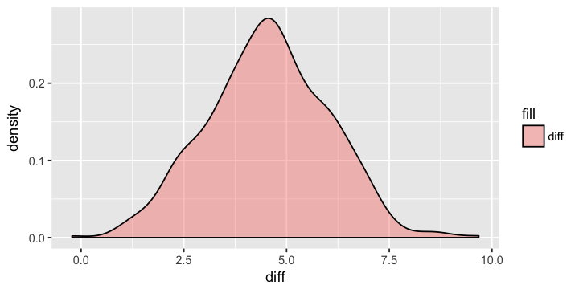

```{r, echo=FALSE, include=FALSE}
library("ggplot2")
library("dplyr")


```


## Agenda 

- Что такое АБ-тест

- Подводные камни АБ-тестов

- Бутстрап, котики и печеньки

<center>
 
</center>


## Что такое АБ-тест

- Во всех сферах бизнеса требуется улучшать показатели

- Идеи улучшения могут быть разными

- Хотим понять какие из них работают 

- Тестируем идеи на маленькой группе пользователей

- Проверяем гипотезу руботают ли, это и есть АБ-тест

## Пример

- Как думаете какая из рамок генерирует большую конверсию для веб-блога о дизайне?

<center>
 
</center>

- Ещё примеры из веба [по ссылке](https://vc.ru/4374-ab-experts)


## Метрики 

- Показатель для улучшения - метрика

- Метрика должна быть привязана к деньгам (выросли ли донаты, продажи)

- Часто денежные метрики грубые и слабо реагируют на изменения или нужно много времени чтобы их измерить 

- Использование промежуточных метрик

- Сайт с арендой квартир: число посетителей за день, число уникальных посетителей и тп

## Где используют АБ-тесты

- Изменение дизайна на сайтах

- изменение функциональности в играх

- Работоспособность лекарств 

- Выкатка алгоритма машинного обучения в прод

- Сбор налогов с помощью красивых деклараций 


## Схема АБ-теста

- Фаза 1: планирование эксперимента, его дизайн

- Фаза 2: сбор статистики, проверка гипотез 

<center>
 
</center>


## Кекс про кока-колу 

- Как на продажи колы повлияет увеличение сахара?

- Фокус-группа пробует напитки 

- С сахаром лучше, повышаем, продажи падают 

- Что пошло не так

<center>
 
</center>

## Кекс про кока-колу (ответ)

Исследование проходило не в тех самых условиях, в которых люди обычно пьют кока-колу. Если речь идёт об одном маленьком стакане, то больше сахара правда нравится людям. Но если напиток употребляется постоянно в больших количествах, то больше сахара - хуже. 

__Мораль:__ тестирование идей должно происходить в максимально приближённых к реальности условиях.

## Другие подводные камни 

> Что ещё может пойти не так? 


## Подводные камни 

- Любые изменения должны тестироваться в максимально приближённых к реальности условиях 

- Хочется проверять много идей сразу, один и тот же пользователь не должен попадать в несколько тестовых групп

- Изменения могут взаимоуничтожать друг-друга

- Выборка пользователей должна быть репрезентативна

- Если выборка связная, может быть важен порядок предъявления изменений
 

## АА-тест

- Иногда, чтобы определить насколько хорошим вышел дизайн эксперимента, используют АА-тест

- Делим пользователей на две группы в соотеветствии с дизайном эксперимента

- Показываем обеим группам старый вариант 

- Если гипотеза о том, что ничего не поменялось не отвергается, то круто, если она отвергается, мы что-то делаем не так

## О котах и печеньках 

- мобильная игра "Cookie Cats", стандартный match-three пазл, а ещё там есть поющие коты

<center>
<p><a href="https://youtu.be/GaP5f0jVTWE"></a></p>
</center>

## Ворота блокировщики 

- По мере того, как игроки проходят уровни, они встречают ворота-блокеры, которые вынуждают их либо ждать длительное время, либо совершить внутриигровую покупку

- Вопрос - когда и где ставить эти ворота

<center>

</center>

## АБ-тест

- Изначально ворота стояли на 30 уровне, их переставили на 40

- Влияние этого изменения на retention (удержание игроков) - отношение уникальных пользователей, зашедших в игру на $N$-ый день после установки ко всем игрокам, усновившим приложение в этот день

<center>

</center>


## Данные для АБ-теста 

- $90189$ наблюдений

- когда игрок устанавливает игру, он случайным образом относится либо к группе `gate_30` с воротами на 30-м уровне либо к группе `gate_40` с воротами на 40-м уровне.

<center>
```{r, echo=FALSE, results = 'hold', fig.height=3, fig.keep='all'}
# Загружаем табличку с данными 
df = read.csv('/Users/fulyankin/Yandex.Disk.localized/R/R_prob_data/cookie_cats.csv', sep=',', dec='.',
               colClasses=c("retention_1"='logical',"retention_7"='logical'))

head(df, 5)  # шапка таблицы
```
</center>


## Распределение числа игровых сессий 


<center>
```{r, echo=FALSE, results = 'hold', fig.height=3, fig.keep='all'}
# Подсчитываем число людей, сыгравших каждое количество раундов
plot_df = df %>% group_by(sum_gamerounds) %>% summarise(number_of_players = n())

# Рисуем распределение этих людей 
options(repr.plot.width=6, repr.plot.height=3)

ggplot(plot_df[1:100,], aes(x=sum_gamerounds, y=number_of_players))+
    geom_line()
```
</center>

- Некоторые игроки установили игру, но даже ни разу не поиграли

- Многие закончили лишь пару сессий, некоторые сыграли более $80$ раз


## Удержание первого дня 

Процент игроков, вернувшихся снова спустя день после установки:

<center>
```{r, results = 'hold', fig.height=3, fig.keep='all'}
mean(df$retention_1)
```
</center>

Удержание первого дня по группам:

<center>
```{r, results = 'hold', fig.height=3, fig.keep='all'}
df %>% group_by(version) %>% summarise(mean(retention_1))
```
</center>

<p> </p>


## Насколько велика разница? 

- Похоже есть небольшое ухудшение в удержании при перносе ворот на 40 уровень

- Можно проверть это $z$-тестом для долей 

<center>
```{r, results = 'hold', fig.height=3, fig.keep='all'}
df_ex = df %>% group_by(version) %>% summarise(m = sum(retention_1),n = n())

test_res = prop.test(x = df_ex$m, n = df_ex$n, correct = FALSE)
test_res
```
</center>


## Бутстрапирование 

- Можно проверить то же самое бустрапом

- Нас интересует распределение двух долей 

- Будем делать выборки с возвратом, считать доли и запоминать их

- Получим распределение для наших долей

## Код для бустрапа 

<center>
```{r, eval=FALSE}
iterations = 500 # число итераций
# В боевых условиях это обычно десятки тысяч итераций

# вектор для средних по воротам на 30 уровне
boot_1d_30 = rep(0, iterations)  
# вектор для средних по воротам на 40 уровне
boot_1d_40 = rep(0, iterations)  

for(i in 1:iterations){
    # генерируем таблицу с повторениями
    # соответствующую по размерам оригинальной
    boot_mean = sample_n(df, size = dim(df)[1], replace=TRUE) %>%
                 group_by(version) %>% 
                 summarise(mean = mean(retention_1))
    
    # считаем средние и записываем их в вектора
    boot_1d_30[i] = boot_mean[1,2]$mean
    boot_1d_40[i] = boot_mean[2,2]$mean    
}


```
</center>


## Распределение долей

<center>
 
</center>

- Оценка распределений 1-day retention для ворот на разных уровнях

- Визуально есть какое-то доказательство разности групп, надо понять насколько они различны

## Распределение разности

<center>
 
</center>

- Разница между группами составляет примерно $1\%$-$2\%$, большая часть распределения справа от нуля

- Вероятность того, что разница больше $0\%$ равна $0.956$ 

- Высокая вероятность того, что удержание первого дня выше в группе с воротам на $30$ уровне

## А что с 7 днями?

- удержание 7 дня по группам также немного ниже для ворот на $40$ уровне

<center>
```{r, results = 'hold', fig.height=3, fig.keep='all'}
df %>% group_by(version) %>% summarise(mean(retention_7))
```
</center>


## Z-тест для 7 дней

- Можно проверть это $z$-тестом для долей 

<center>
```{r, results = 'hold', fig.height=3, fig.keep='all'}
df_ex = df %>% group_by(version) %>% summarise(m = sum(retention_7),n = n())

test_res = prop.test(x = df_ex$m, n = df_ex$n, correct = FALSE)
test_res
```
</center>


## Бустрап для 7 дней 

<center>
 
</center>

- Вероятность того, что разность больше нуля $0.998$

## Выводы 

- Превышение 7-day retentio в группе с воротами на $30$ уровне над группой с вортами на $40$ уровне значимо

- Ежели хотим больше игроков, то оставляем ворота на $30$ уровне

- Давайте подумаем насколько существенен эффект от ворот на $30$ уровне

<center>

</center>

## Микра подъехала 

Почему когда ворота раньше ретеншн выше? Логично было бы обратное - чем позже ставится препятствие, тем дольше игроки взаимодействуют с игрой. 

На самом деле нет. Теория геденетстической адаптации может помочь с объяснением. Геденестическая адаптация - тенденция получать всэ мнеьше удовольствия от деятельности, если она продолжается длительное время. 

Заставляя игроков сделать паузу, мы продлеваем их удовольствие и они хотят вернуться. Отодвигая ворота, мы даём игрокам наиграться и заскучать. 


